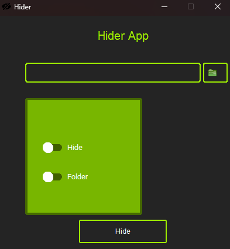

# This is Hider App
in this app you can hide file and folder but if **hide dont see file or folder with checkbox hideicon**
> * note if hide Program you shoud save path file for unhide
if not working app follow billow help

```bash
pip install customtkinter
pip install Pillow
pip install CTkMessagebox
```



for more information message to email